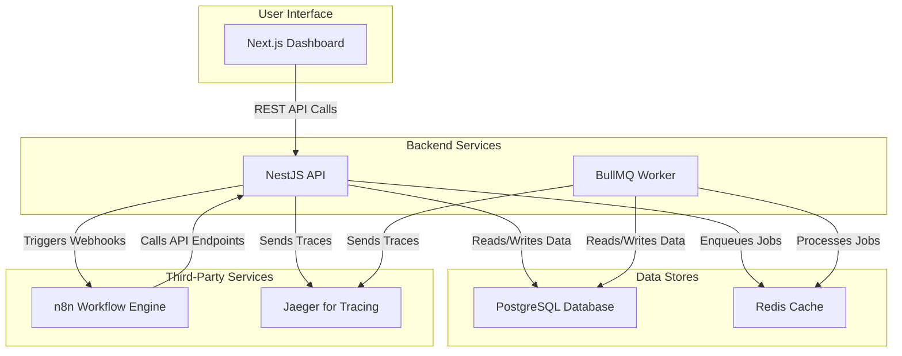

# **Marketing Automation & Campaign Orchestration Platform**

---

### **1. Project Overview**

This repository contains the source code for a **Marketing Automation Platform**, a system that allows businesses to automate customer engagement through scheduled campaigns, event-based triggers, and multi-step workflows.

The primary goal is to build a scalable, observable, and cloud-deployable system that:
- Accepts campaign creation and scheduling requests via a REST API.
- Processes user segmentation and sends campaign messages asynchronously using background workers.
- Integrates with **n8n** to orchestrate complex marketing workflows.
- Provides a simple web dashboard for managing users, campaigns, and automation flows.

---

### **2. Architecture**



---

### **3. Getting Started**

This guide will walk you through setting up the project for local development.

**Prerequisites:**
- **Node.js:** v20 or higher
- **pnpm:** A fast, disk space-efficient package manager.
- **Docker:** For running services like PostgreSQL and Redis in isolated containers.
- **k6:** For running load tests. [Installation Guide](https://k6.io/docs/getting-started/installation/)

**Installation Steps:**

1.  **Clone the Repository:**
    ```bash
    git clone https://github.com/your-username/your-repo-name.git
    cd your-repo-name
    ```

2.  **Install Dependencies:**
    This command installs dependencies for all applications and packages in the monorepo.
    ```bash
    pnpm install
    ```

3.  **Configure Environment Variables:**
    The project uses `.env` files for environment-specific variables.
    ```bash
    # Copy the root environment file
    cp .env.example .env

    # Copy the API-specific environment file
    cp apps/api/.env.example apps/api/.env
    ```
    Now, open both `.env` files and fill in the required values (e.g., database credentials, JWT secret).

4.  **Start Infrastructure Services:**
    This command starts the PostgreSQL, Redis, n8n, and Jaeger containers using Docker Compose.
    ```bash
    docker-compose up -d
    ```

5.  **Run Database Migrations:**
    This command applies the latest database schema to your local PostgreSQL instance.
    ```bash
    pnpm --filter api exec prisma migrate dev
    ```

6.  **Run the Applications:**
    You'll need two separate terminal sessions to run the backend and frontend concurrently.
    ```bash
    # In terminal 1: Start the NestJS API
    pnpm --filter api start:dev

    # In terminal 2: Start the Next.js Dashboard
    pnpm --filter dashboard dev
    ```

    - The API will be available at `http://localhost:3001`.
    - The dashboard will be available at `http://localhost:3000`.
    - The Jaeger UI will be available at `http://localhost:16686`.

---

### **4. Project Structure**

This project is a **monorepo** managed by `pnpm` workspaces. This structure helps organize code and share configurations between different parts of the application.

- **`apps/api`**: The backend **NestJS** application.
- **`apps/dashboard`**: The frontend **Next.js** application.
- **`packages/`**: Shared libraries and types.
- **`n8n-workflows/`**: Exported JSON files for n8n workflows.
- **`terraform/`**: Infrastructure-as-Code scripts for provisioning AWS resources.
- **`k6/`**: Load testing scripts.

---

### **5. Project Roadmap & Tasks**

This project is broken down into the following phases and micro-tasks.

#### **Phase 0: Project Setup (Completed) ✅**
- [x] Initialize `pnpm` monorepo.
- [x] Set up NestJS application in `apps/api`.
- [x] Set up Docker Compose with PostgreSQL and Redis.
- [x] Define initial Prisma schema for core models.
- [x] Create modular folder structure in the API.
- [x] Implement a `/health` check endpoint with DB connection check.

---

#### **Phase 1: Core Backend - Authentication, Users & RBAC (Completed) ✅**
- [x] **Auth Module (`apps/api/src/auth`)**
- [x] **Users Module (`apps/api/src/users`)**
- [x] **RBAC (Role-Based Access Control)**
- [x] **Security Features** (Rate Limiting, Validation, CORS)

---

#### **Phase 2: Core Backend - Campaigns, Flows, Segments, Events & Async Jobs (Completed) ✅**
- [x] **Flows Module (`apps/api/src/flows`)**
- [x] **Campaigns Module (`apps/api/src/campaigns`)**
- [x] **Jobs Module & BullMQ Integration (`apps/api/src/jobs`)**
- [x] **Segments Module (`apps/api/src/segments`)**
- [x] **Events Module (`apps/api/src/events`)**
- [x] **FailureLog Model**

---

#### **Phase 3: Frontend Dashboard - Initial Setup & Auth (Completed) ✅**
- [x] **Project Initialization** (Next.js, shadcn/ui)
- [x] **Authentication** (Login, Register, Protected Routes)

---

#### **Phase 4: Frontend Dashboard - Campaign & Flow Management (Completed) ✅**
- [x] **Flow Management**
- [x] **Campaign Management**

---

#### **Phase 5: n8n Integration for Advanced Workflows (Completed) ✅**
- [x] **N8N Service Module (`apps/api/src/n8n`)**
- [x] **Workflow 1: Job Failure Alert**
- [x] **Workflow 2: Daily Scheduled Campaigns**
- [x] **Documentation**

---

#### **Phase 6: Advanced Features, Deployment & Observability (Completed) ✅**
- [x] **Infrastructure-as-Code (IaC)**
- [x] **CI/CD**
- [x] **Observability**
- [x] **Testing**
- [x] **Documentation**

---

### **6. Next Steps**

This project is now in a comprehensive state, with all the core features and advanced infrastructure components implemented. Here are some suggestions for what you can do in your next session:

- **Explore the Codebase:** Familiarize yourself with the structure of the `apps/api` and `apps/dashboard` applications.
- **Run the Application:** Follow the "Getting Started" guide to run the project on your local machine and interact with the dashboard.
- **Run the Tests:** Execute the k6 load tests to see how the application performs under load.
- **Extend the Functionality:** Consider adding new features, such as:
  - A more advanced visual flow builder.
  - Real-time updates on the dashboard using WebSockets.
  - More detailed analytics and reporting.
- **Deploy to AWS:** Use the Terraform scripts to provision the infrastructure on AWS and deploy the application using the CI/CD pipeline.